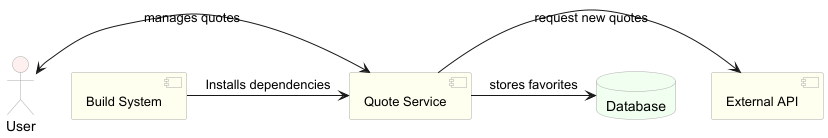
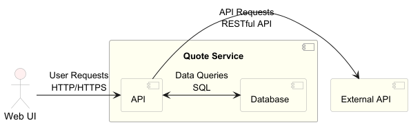
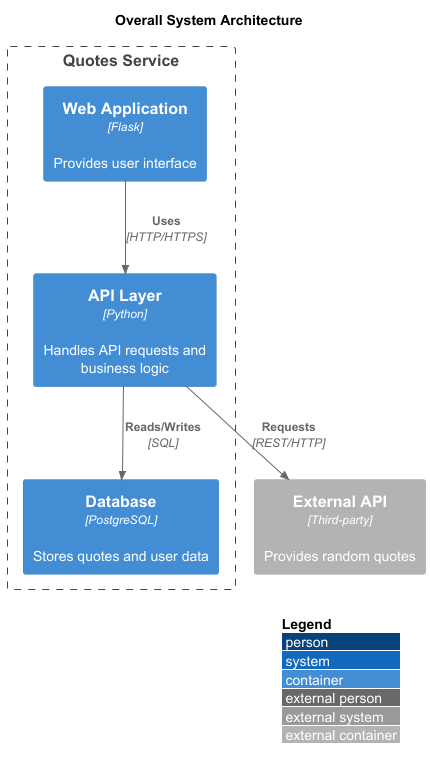
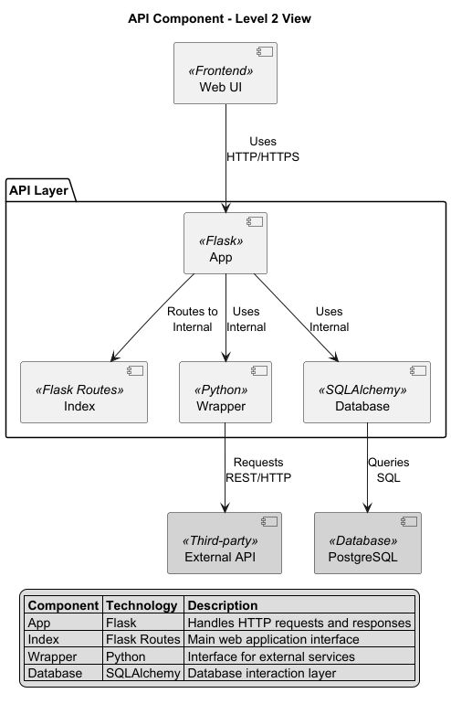
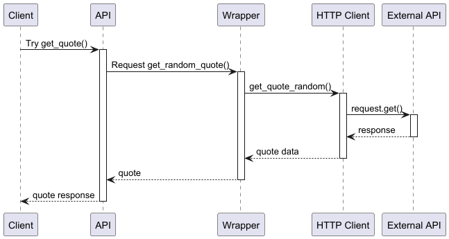
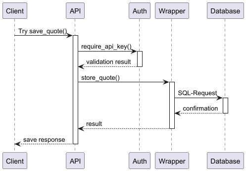
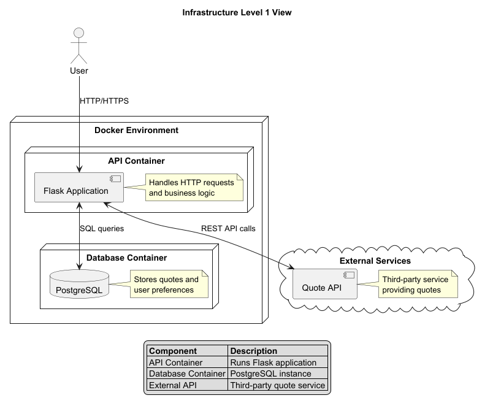

# QuotesService API

# 1 Introduction and Goals 

The primary goal of the QuotesService API is to provide a simple and user-friendly interface for fetching and saving quotes. 
The API is designed to be intuitive and easy to use and includes a Web application for easy access.

## Requirements Overview


The QuotesService API aims to provide a simple, intuitive interface for fetching and saving quotes, 
accessible via both a RESTful API and a web application. 
The main functional and non-functional requirements are:

| Requirement Type | Description                                                                         |
|------------------|-------------------------------------------------------------------------------------|
| Functional       | Fetch random quotes and save favorite quotes.                                       |
| Functional       | Provide a user-friendly web application for interacting with the API                |
| Non-Functional   | Ensure reliability, robustness, and minimal downtime.                               |
| Non-Functional   | Support scalability to handle increasing users and data volume.                     |
| Non-Functional   | Implement strong security measures to protect data and prevent unauthorized access. |
| Non-Functional   | Deliver an intuitive, easy-to-use interface for both API and web application.       |

Motivation:
The system is designed to improve user engagement with quotes, 
streamline quote management, and ensure a high-quality, secure, and scalable experience for all users

## Quality Goals

The following quality goals are prioritized for the architecture, as they are most important to stakeholders:

| Priority  | Quality Goal    | Scenario                                                                          |
|-----------|-----------------|-----------------------------------------------------------------------------------|
| 1         | Performance     | The application responds to user actions within 2 seconds, even under high load.  |
| 2         | Reliability     | The application responds to user actions within 2 seconds, even under high load.  |
| 3         | Security        | User data is protected through authentication, authorization, and encryption.     |
| 4         | Usability       | Users can access and use the application without training or prior experience.    |
| 5         | Maintainability | The codebase is modular and well-documented, enabling easy updates and bug fixes. |

## Stakeholders

| Role/Name                     | Contact                               | Expectations                                                                                                      |
|-------------------------------|---------------------------------------|-------------------------------------------------------------------------------------------------------------------|
| Third-Party Service Providers | https://api.forismatic.com/api/1.0/   | Clear integration guidelines, reliable performance, and timely support for API-related issues.                    |
| Developer                     | https://github.com/Jakob0901          | Modular, well-documented architecture; easy development and maintenance; access to necessary tools and resources. |
| End User                      | https://github.com/Jakob0901/SQS-Demo | Seamless, intuitive user experience; quick response times; engaging features.                                     |
| Administrator                 | https://github.com/Jakob0901/SQS-Demo | Robust admin tools; comprehensive user management; system monitoring; strong security measures.                   |


# 2 Architecture Constraints

| Type           | Constraint                                                                                               | Explanation                                                                                            |
|----------------|----------------------------------------------------------------------------------------------------------|--------------------------------------------------------------------------------------------------------|
| Technical      | The application must be containerized using Docker.                                                      | Ensures consistent environments and simplifies deployment across development, testing, and production. |
| Technical      | The application must store data in a SQL database.                                                       | Guarantees data integrity, reliability, and supports transactional operations.                         |
| Technical      | The application must expose RESTful APIs.                                                                | Facilitates easy integration with other services and applications.                                     |
| Technical      | The application must be built with a language supporting robust testing frameworks (e.g., Python, Java). | Enables automated testing and ensures code quality and maintainability.                                |
| Organizational | Must comply with company-wide security and data protection policies.                                     | Ensures legal compliance and protects user data.                                                       |
| Convention     | Code must follow established style guides and documentation standards.                                   | Promotes readability, maintainability, and team collaboration.                                         |

# 3 Context and Scope

## Business Context 

### Context Diagram



### Communication Partners

| Communication Partner | Inputs                                          | Outputs                                    |
|-----------------------|-------------------------------------------------|--------------------------------------------|
| Users/Web UI          | User requests, search queries, user preferences | quotes, search results, user notifications |
| External API          | API requests, authentication tokens             | data, API responses                        |
| Database              | Data queries, data updates                      | Query results, data confirmations          |
| Quote Service         | Build requests, code changes                    | Build artifacts, deployment notifications  |
| Build System          | Build requests, code changes                    | Build artifacts, deployment notifications  |

### Description

### Description

- **Users/Web UI**: Interact with the application to search for, discover, and share quotes. Users provide input through the user interface and receive outputs such as search results and notifications.
- **External API**: Provides additional data and functionalities. The application sends API requests with authentication tokens and receives responses containing quotes data.
- **Database**: Stores and retrieves application data. The application sends data queries and updates, receiving query results and confirmations.
- **Quote Service**: Handles application logic and processing. Receives build requests and code changes, producing build artifacts and deployment notifications.
- **Build System**: Manages the build and deployment pipeline. Processes build requests and code changes, generating build artifacts and deployment notifications.

## Technical Context



### Communication Partners
| Domain-Specific I/O | Channel/Protocol | Transmission Media | Description                                                                |
|---------------------|------------------|--------------------|----------------------------------------------------------------------------|
| Web UI              | HTTP/HTTPS       | Web browsers       | Users interact with the application through web browsers using HTTP/HTTPS. |
| API                 | RESTful API      | API servers        | The application sends API requests to external APIs using RESTful API.     |
| Database            | SQL              | Database servers   | The application sends data queries to the database using SQL.              |
| External API        | RESTful API      | Cloud services     | The application communicates with external APIs using RESTful API.         |

### Description

- **Web UI**: Interact with the application through web browsers using HTTP/HTTPS protocols.
- **API**: The application sends API requests to external APIs using RESTful API through API servers.
- **Database**: Sends data queries to the database using SQL through database servers.
- **External API**: Communicates with external APIs using RESTful API through cloud services.

# 4 Solution Strategy

| Quality Goal   | Scenario                                                              | Solution Approach                                                                | Link to Details |
|----------------|-----------------------------------------------------------------------|----------------------------------------------------------------------------------|-----------------|
| Performance    | Users expect quick response times for interactions.                   | Optimize database queries, use caching mechanisms, and implement load balancing. | Section 5.1     |
| Scalability    | The application must handle an increasing number of users and quotes. | Design for horizontal scaling, use container orchestration (e.g., Kubernetes).   | Section 5.2     |
| Security       | Protect user data and ensure secure interactions.                     | Implement encryption, secure authentication, and regular security audits.        | Section 5.3     |
| Reliability    | Ensure minimal downtime and robust failover mechanisms.               | Use redundant systems, implement health checks, and monitor system performance.  | Section 5.4     |
| Usability      | Provide an intuitive and engaging user experience.                    | Conduct user testing, follow UX best practices, and gather user feedback.        | Section 5.5     |
| Data Integrity | Ensure data is stored reliably and accurately.                        | Use a SQL database (PostgreSQL) to ensure data integrity and reliability.        | Section 5.6     |
| Integration    | Ensure easy integration with other services and applications.         | Design with RESTful APIs to facilitate seamless integration.                     | Section 5.7     |

# 5 Building Block View 

## Whitebox Overall System 



Rational:
1. Clear separation of concerns between Web application, API, and database layers
2. Components are interconnected to support system functionality 
3. Web application enables user interaction and interface
4. External API integration provides random quote functionality
5. Database ensures persistent data storage and retrieval

## Level 2 



Contained Blackboxes:

| Blackbox | Description                                                                                                                                                                                                                         |
|----------|-------------------------------------------------------------------------------------------------------------------------------------------------------------------------------------------------------------------------------------|
| app      | Core Flask application component that handles routing, HTTP request/response cycles, error handling, and API key validation. Acts as the main entry point for all incoming requests.                                                |
| index    | Frontend controller component that manages the web interface rendering, user interactions, and template handling. Responsible for displaying quotes and handling user actions like saving favorites.                                |
| wrapper  | Service abstraction layer that encapsulates third-party API interactions. Implements retry logic, error handling, and provides a clean interface for quote operations. Contains both internal and external wrapper implementations. |
| database | Data access layer using SQLAlchemy ORM for PostgreSQL interactions. Handles database connections, query execution, transaction management, and data model mappings.                                                                 |

### Blackbox

#### app
Flask-based core application component that:
- Serves as the main HTTP request/response handler
- Manages API endpoints and routing logic
- Implements authentication via API key validation
- Provides error handling and request logging
- Handles session management and request lifecycle
- Contains routes for quote operations (fetch, save, retrieve)
- Integrates with wrapper and database components

#### index
Frontend controller component responsible for:
- Rendering the main web interface using Vue.js
- Managing user interactions and form submissions
- Handling quote display and management operations
- Implementing client-side validations
- Managing user session state

#### wrapper
Service abstraction layer divided into two main components:
- Internal wrapper:
  - Provides unified interface for service interactions
  - Handles retry logic and error recovery
  - Implements circuit breaker patterns
  - Manages service timeouts and fallbacks
- External wrapper:
  - Encapsulates third-party API communications
  - Implements specific API integration logic
  - Handles rate limiting and quota management
  - Provides data transformation and validation

#### database
SQLAlchemy-based data access layer that:
- Manages PostgreSQL database connections
- Implements ORM models and relationships
- Handles transaction management
- Provides CRUD operations for quotes
- Implements connection pooling
- Manages database migrations
- Ensures data integrity and consistency
- 
# 6 Runtime View {#section-runtime-view}

## Request Quote



1. Try get_quote: access on the api to retrieve a random quote.
2. Request get_random_quote: Call the wrapper class to get a random quote from the third-party API.
3. get_quote_random: call the http client to get a random quote from the third-party API.
4. request.get: Send a GET request to the third-party API to retrieve a random quote.

## Save Quote



1. Try save_quote: Client sends a request to the API to save a quote
2. require_api_key: API validates the provided API key through Auth service
3. store_quote: Upon successful authentication, API calls the wrapper class to save the quote
4. SQL-Request: Wrapper executes database operation through SQLAlchemy
5. Response flow: Database confirms operation, result passes back through wrapper and API to client

## Retrieve saved Quotes

# 7 Deployment View

## Infrastructure Level 1 

### Infrastructure Overview

The QuotesService consists of two containerized services deployed in a simple, efficient architecture:

1. API Service (Flask application)
2. PostgreSQL Database



### Key Components

| Component          | Description                                                                  |
|--------------------|------------------------------------------------------------------------------|
| API Container      | Runs the Flask application that handles all HTTP requests and business logic |
| Database Container | PostgreSQL instance that stores quote data and user preferences              |
| Docker Network     | Connects the two containers, enabling secure communication                   |

### Quality Characteristics

- **Simplicity**
  - Minimal infrastructure footprint
  - Easy to deploy and maintain
  - Clear service boundaries

- **Reliability**
  - Containerized services for consistent environments
  - Database persistence for data durability
  - Isolated service components

- **Security**
  - Contained network communication
  - API key authentication
  - Encrypted data transmission

### Infrastructure Mapping

| Building Block | Infrastructure Component |
|----------------|-------------------------|
| API Service | Docker container running Flask application |
| Database | Docker container running PostgreSQL |
| Network | Docker internal network |

# 8 Cross-cutting Concepts {#section-concepts}

## Authentication

**Purpose**
Prevent unauthorized access to the application and its data by implementing secure authentication mechanisms.

**Implementation**

```python
def require_api_key(f):
    @wraps(f)
    def decorated_function(*args, **kwargs):
        if request.headers.get('x-api-key') == API_KEY:
            return f(*args, **kwargs)
        else:
            return jsonify({"message": "Forbidden"}), 403

    return decorated_function
```

The implementation of authentication in the application is done using API keys.
It is implemented with a decorator function that checks the API key in the request headers.
If the API key is valid, the request is processed; otherwise, a 403 Forbidden response is returned.

**Impact**

The implementation of authentication in the application ensures that only authorized users can access the API and its resources.

## Tenacity

**Purpose**

The purpose of implementing tenacity in the application is to ensure that the application can handle transient errors and retries requests when necessary.
Transient errors can occur due to network issues, temporary unavailability of services, or other factors that may cause a request to fail.
By implementing tenacity, the application can automatically retry failed requests, improving reliability and user experience.
This is used for the connection with the the third-party API.

**Implementation**

```python
from tenacity import retry

@retry(
    stop=stop_after_attempt(3),
    retry=retry_if_exception_type(QuoteApiError)
)
def get_random_quote(self):
    # do request
    pass
```

The implementation of tenacity in the application is done using the tenacity library.
The `@retry` decorator is used to automatically retry the `get_random_quote` method when it fails.
This is handled in the wrapper class of the API.

**Impact**

The implementation of tenacity in the application ensures that the application can handle transient errors and retries requests when necessary.

## Logging

**Purpose**

The purpose of logging in the application is to provide a mechanism for tracking and recording events, errors, and other important information during the application's execution.
Logging is essential for debugging, monitoring, and maintaining the application, as it allows developers and administrators to understand the application's behavior and identify issues.

**Implementation**

```python
import logging

logging.basicConfig(level=logging.INFO)

logger = logging.getLogger(__name__)

logger.info("This is an info message")
```

The implementation of logging in the application is done using the built-in logging module in Python.

**Impact**

The implementation of logging in the application ensures that important events and errors are recorded, allowing developers and administrators to monitor the application's behavior and troubleshoot issues effectively.

## Error Handling

**Purpose**
The purpose of error handling in the application is to gracefully manage unexpected situations and provide meaningful feedback to users and developers.
It is designed to always return a valid response, even in the event of an error, ensuring that the application remains stable and user-friendly.
The application returns status codes and error messages in a consistent format, allowing users to understand the nature of the error and take appropriate action.

**Implementation**

```python
from flask import jsonify
import logging

logger = logging.getLogger(__name__)

def get_quote(self):
    logger.debug("Zufälliges Zitat wird angefordert")
    try:
            # do sth
            return jsonify("result": "successful response"), 200
        except QuoteServiceError as e:
            logger.error("Fehler", exc_info=True)
            return jsonify({"error": "Interner Serverfehler"}), 500
```

***Impact***

The implementation of error handling in the application ensures that unexpected situations are managed gracefully and provides predictable behavior, providing meaningful feedback to users and developers.

# 9 Architecture Decisions {#section-design-decisions}

Architecture decisions are recorded in the adr folder located at docs/adr.
A list of all architecture decisions can be found in the [Architecture Decision Records (ADRs)](./adr_list.md) document.

# 10 Quality Requirements {#section-quality-scenarios}

## Quality Requirements Overview

| ID      | Description                                                                                                                                      |
|---------|--------------------------------------------------------------------------------------------------------------------------------------------------|
| 10.1.1  | Users can easily navigate the application and discover quotes without requiring extensive training or documentation.                             |
| 10.1.2  | The application provides clear and concise error messages that help users understand and resolve issues quickly.                                 |
| 10.1.3  | The application's modular architecture allows for easy updates and maintenance, with well-documented code and clear separation of concerns.      |
| 10.1.4  | Comprehensive test coverage ensures that changes to the codebase do not introduce new issues, facilitating safe and reliable updates.            |
| 10.1.5  | The application implements robust error handling and data validation to ensure reliable operation and data integrity.                            |
| 10.1.6  | The application is designed to handle high user loads efficiently, ensuring optimal performance and responsiveness even during peak usage times. |

## Quality Scenarios 

| ID     | Context/Background                                            | Sources/Stimulus                                         | Metric/Acceptance Criteria                                                                                                                |
|--------|---------------------------------------------------------------|----------------------------------------------------------|-------------------------------------------------------------------------------------------------------------------------------------------|
| 10.2.1 | Users navigating the application to discover quotes.          | User interacts with the application interface.           | Users can find and share quotes within 3 clicks or less, with a response time of under 2 seconds for each interaction.                    |
| 10.2.2 | Users encountering errors while using the application.        | User performs an action that results in an error.        | The application displays clear and concise error messages, guiding users to resolve the issue within 10 seconds.                          |
| 10.2.2 | Users encountering errors while using the application.        | User performs an action that results in an error.        | The application displays clear and concise error messages, guiding users to resolve the issue within 10 seconds.                          |
| 10.2.3 | Application handling high user loads during peak usage times. | Multiple users accessing the application simultaneously. | The application maintains a response time of under 2 seconds for 95% of user interactions, even with 1000 concurrent users.               |
| 10.2.4 | Application performing data validation and error handling.    | User submits data to the application.                    | The application validates data and handles errors gracefully, ensuring data integrity and providing feedback to the user within 1 second. |


# 11 Risks and Technical Debts 

| Risk                                              | Description                                                                                                                                                                                     |
|---------------------------------------------------|-------------------------------------------------------------------------------------------------------------------------------------------------------------------------------------------------|
| Data Security and Privacy                         | Ensuring the security and privacy of user data is critical. Any breaches or non-compliance with data protection regulations could result in legal issues and loss of user trust.                |
| Scalability and Performance                       | As the user base grows, the application must handle increased load without performance degradation. Inadequate scalability measures could lead to slow response times and poor user experience. |
| Dependency on External APIs                       | The application depends on an external API for various functionalities. Any changes or downtime in these APIs could affect the application's performance and reliability.                       |
| Compatibility with Multiple Platforms             | Ensuring the application is compatible with multiple platforms and devices is challenging. Inadequate testing and optimization could result in a poor user experience on certain platforms.     |
| Compliance with Legal and Regulatory Requirements | The application must comply with various legal and regulato ry requirements. Non-compliance could result in legal issues, fines, and damage to the application's reputation.                    |
| Maintenance and Support                           | Providing ongoing maintenance and support is essential for the application's success. Inadequate resources or planning could lead to unresolved issues and reduced user satisfaction.           |

# 12 Glossary

| Term         | Definition                                                                                       |
|--------------|--------------------------------------------------------------------------------------------------|
| API Key      | A unique identifier used to authenticate and control access to the API endpoints                 |
| Flask        | A lightweight Python web framework used to build the application                                 |
| PostgreSQL   | The SQL database management system used for persistent data storage                              |
| REST/RESTful | Architectural style for designing networked applications, using HTTP methods for data operations |
| SQLAlchemy   | An SQL toolkit and Object-Relational Mapping (ORM) library for Python                            |
| Tenacity     | A Python library implementing retry behavior for unreliable operations                           |
| Docker       | A platform for developing, shipping, and running applications in containers                      |
| ACID         | Atomicity, Consistency, Isolation, Durability - properties of database transactions              |
| ORM          | Object-Relational Mapping - technique for converting data between incompatible type systems      |
| CI/CD        | Continuous Integration/Continuous Deployment - automated software delivery process               |
