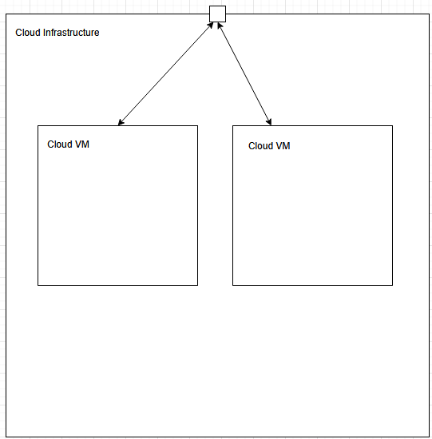

# Moviequotes

**About arc42**

arc42, the template for documentation of software and system
architecture.

Template Version 8.2 EN. (based upon AsciiDoc version), January 2023

Created, maintained and © by Dr. Peter Hruschka, Dr. Gernot Starke and
contributors. See <https://arc42.org>.

# 1 Introduction and Goals 

The primary goal of the MovieQuotes API is to provide a simple and user-friendly interface for fetching and saving movie quotes. 
The API is designed to be intuitive and easy to use and includes a Web application for easy access.

## Requirements Overview

This section describes the relevant requirements and the driving forces that software architects and development team must consider. 
These include:

- Functional Requirements: The API must allow users to fetch random quotes, search for quotes by author or movie, and save new quotes.
- Functional Requirements: The API must allow users to fetch random quotes, and save new quotes.
- Functional Requirements: The API must allow users to access a Web application that provides a user-friendly interface for interacting with the API.
- Functional Requirements: The Web application must allow users to view and save quotes.
- Non-Functional Requirements: The API must be able to handle a growing number of users and quotes without significant performance degradation.
- Non-Functional Requirements: The application must be reliable and robust, with minimal downtime and errors.
- Non-Functional Requirements: The application must be secure, with appropriate measures to protect against unauthorized access and data breaches.
- Non-Functional Requirements: The application must be intuitive and easy to use, with a clean and user-friendly interface.
- Non-Functional Requirements: The API must be performant, scalable, and secure. It should also provide a user-friendly interface for the Web application.

## Quality Goals

The architecture of the application must meet the following quality goals:

- Performance: The application should respond quickly to user interactions, ensuring a smooth and responsive experience.
- Reliability: The application should be robust and reliable, with minimal downtime and errors.
- Security: User data and interactions should be secure, with appropriate measures to protect against unauthorized access and data breaches.
- Usability: The application should be intuitive and easy to use, with a clean and user-friendly interface.
- Maintainability: The codebase should be well-structured and easy to maintain, with clear documentation and a modular design.

## Stakeholders

| Role/Name | Contact                               | Expectations                                                                                                         |
|-----------|---------------------------------------|----------------------------------------------------------------------------------------------------------------------|
| Third-Party Service Providers | https://api.quotable.io/              | Clear integration guidelines, reliable performance, and timely support for API-related issues.                       |
| Developer | https://github.com/Jakob0901          | Well-documented and modular architecture, easy development and maintenance, access to necessary tools and resources. |
| End User | https://github.com/Jakob0901/SQS-Demo | Seamless and enjoyable user experience, intuitive interface, quick response times, and engaging features.            |
| Administrator | https://github.com/Jakob0901/SQS-Demo | Robust administrative tools, comprehensive user management, system monitoring, and security measures.                |


# 2 Architecture Constraints 

- The application must be containerized using Docker to ensure consistency across different environments and facilitate easy deployment.
- The application must be store data in a SQL database to ensure data integrity and reliability.
- The application must be built with a programming language supporting various testing frameworks like Python, Java, or C#.
- The application must be designed with restful APIs to ensure easy integration with other services and applications.

# 3 Context and Scope

## Business Context 

**\<Diagram or Table>**

**\<optionally: Explanation of external domain interfaces>**

## Technical Context

**\<Diagram or Table>**

**\<optionally: Explanation of technical interfaces>**

**\<Mapping Input/Output to Channels>**

# 4 Solution Strategy

| Quality Goal | Scenario | Solution Approach                                                                | Link to Details |
|--------------|-----|----------------------------------------------------------------------------------|-----------------|
| Performance  | Users expect quick response times for interactions.  | Optimize database queries, use caching mechanisms, and implement load balancing. | Section 5.1     |
| Scalability  | The application must handle an increasing number of users and quotes.  | Design for horizontal scaling, use container orchestration (e.g., Kubernetes).   | Section 5.2     |
| Security     | Protect user data and ensure secure interactions.  | Implement encryption, secure authentication, and regular security audits.        | Section 5.3     |
| Reliability     | Ensure minimal downtime and robust failover mechanisms.  | Use redundant systems, implement health checks, and monitor system performance.  | Section 5.4     |
| Usability     | Provide an intuitive and engaging user experience.  | Conduct user testing, follow UX best practices, and gather user feedback.        | Section 5.5     |
| Data Integrity     | Ensure data is stored reliably and accurately.  | Use a SQL database (PostgreSQL) to ensure data integrity and reliability.        | Section 5.6     |
| Integration     | Ensure easy integration with other services and applications.  | Design with RESTful APIs to facilitate seamless integration.        | Section 5.7     |

# 5 Building Block View 

## Whitebox Overall System 

***\<Overview Diagram>***

Motivation

:   *\<text explanation>*

Contained Building Blocks

:   *\<Description of contained building block (black boxes)>*

Important Interfaces

:   *\<Description of important interfaces>*

### \<Name black box 1> {#__name_black_box_1}

*\<Purpose/Responsibility>*

*\<Interface(s)>*

*\<(Optional) Quality/Performance Characteristics>*

*\<(Optional) Directory/File Location>*

*\<(Optional) Fulfilled Requirements>*

*\<(optional) Open Issues/Problems/Risks>*

### \<Name black box 2> {#__name_black_box_2}

*\<black box template>*

### \<Name black box n> {#__name_black_box_n}

*\<black box template>*

### \<Name interface 1> {#__name_interface_1}

...

### \<Name interface m> {#__name_interface_m}

## Level 2 {#_level_2}

### White Box *\<building block 1>* {#_white_box_emphasis_building_block_1_emphasis}

*\<white box template>*

### White Box *\<building block 2>* {#_white_box_emphasis_building_block_2_emphasis}

*\<white box template>*

...

### White Box *\<building block m>* {#_white_box_emphasis_building_block_m_emphasis}

*\<white box template>*

## Level 3 {#_level_3}

### White Box \<\_building block x.1\_\> {#_white_box_building_block_x_1}

*\<white box template>*

### White Box \<\_building block x.2\_\> {#_white_box_building_block_x_2}

*\<white box template>*

### White Box \<\_building block y.1\_\> {#_white_box_building_block_y_1}

*\<white box template>*

# 6 Runtime View {#section-runtime-view}

## \<Runtime Scenario 1> {#__runtime_scenario_1}

-   *\<insert runtime diagram or textual description of the scenario>*

-   *\<insert description of the notable aspects of the interactions
    between the building block instances depicted in this diagram.\>*

## \<Runtime Scenario 2> {#__runtime_scenario_2}

## ... {#_}

## \<Runtime Scenario n> {#__runtime_scenario_n}

# 7 Deployment View 

**Content**

The deployment view describes:

- The technical infrastructure used to execute your system, including environments, servers, processors, channels, network topologies, and other infrastructure elements.
- The mapping of (software) building blocks to these infrastructure elements.

**Motivation**

Software does not run without hardware. 
This underlying infrastructure can and will influence your system and/or some cross-cutting concepts. 
Therefore, you need to know the infrastructure.

## Infrastructure Level 1 

Description

The movie quotes application is deployed across multiple environments to ensure development, testing, and production needs are met. 
The infrastructure includes:

**_Overview Diagram_**



Motivation

:   The deployment structure is designed to ensure high availability, low latency, and efficient resource utilization. 
The application is deployed in a cloud environment, ensuring scalability and flexibility.
The application is containerized using Docker, allowing for easy deployment and management of services.
By utilizing a microservices architecture, the application can be easily maintained.

Quality and/or Performance Features

:   **High Availability**:The application is designed to be highly available by utilizing a microservices architecture, that can be quickly booted, modified and scaled as needed.<br>
**Scalability**: The cloud-based infrastructure allows for easy scaling of resources to handle increased load and user base.<br>
**Security**: The application is designed with security in mind, utilizing encryption and secure authentication methods to protect user data and interactions.

Mapping of Building Blocks to Infrastructure

:  **Production Enviroment:** The production environment is where the application is deployed and accessed by end-users.
**Cloud VMs**: The application is deployed on cloud-based virtual machines (VMs) to ensure scalability and flexibility.
**Cloud Infrastructure**: The application is hosted on a cloud infrastructure, allowing for easy scaling and management of resources.

## Infrastructure Level 2 {#_infrastructure_level_2}

### Application 

**Overview Diagram**


**Explanation**
:   **Restful APIs**: The application is designed with RESTful APIs to facilitate seamless integration with other services and applications. 
It also provides a user-friendly interface for the Web application.<br>
**Database**: The application uses a SQL database (PostgreSQL) to ensure data integrity and reliability.'
**API**: The application relies on third-party services for social sharing and other functionalities.
**Web Application**: The application provides a user-friendly interface for interacting with the API, allowing users to view and save quotes.

# 8 Cross-cutting Concepts {#section-concepts}

## Authentication

**Purpose**
Prevent unauthorized access to the application and its data by implementing secure authentication mechanisms.

**Implementation**

```python
def require_api_key(f):
    @wraps(f)
    def decorated_function(*args, **kwargs):
        if request.headers.get('x-api-key') == API_KEY:
            return f(*args, **kwargs)
        else:
            return jsonify({"message": "Forbidden"}), 403

    return decorated_function
```

The implementation of authentication in the application is done using API keys.
It is implemented with a decorator function that checks the API key in the request headers.
If the API key is valid, the request is processed; otherwise, a 403 Forbidden response is returned.

**Impact**

The implementation of authentication in the application ensures that only authorized users can access the API and its resources.

## Tenacity

**Purpose**

The purpose of implementing tenacity in the application is to ensure that the application can handle transient errors and retries requests when necessary.
Transient errors can occur due to network issues, temporary unavailability of services, or other factors that may cause a request to fail.
By implementing tenacity, the application can automatically retry failed requests, improving reliability and user experience.
This is used for the connection with the the third-party API.

**Implementation**

```python
from tenacity import retry

@retry
def get_random_quote(self):
    # do request
    pass
```

The implementation of tenacity in the application is done using the tenacity library.
The `@retry` decorator is used to automatically retry the `get_random_quote` method when it fails.
This is handled in the wrapper class of the API.

**Impact**

The implementation of tenacity in the application ensures that the application can handle transient errors and retries requests when necessary.

## Logging

**Purpose**

The purpose of logging in the application is to provide a mechanism for tracking and recording events, errors, and other important information during the application's execution.
Logging is essential for debugging, monitoring, and maintaining the application, as it allows developers and administrators to understand the application's behavior and identify issues.

**Implementation**

```python
import logging

logging.basicConfig(level=logging.INFO)

logger = logging.getLogger(__name__)

logger.info("This is an info message")
```

The implementation of logging in the application is done using the built-in logging module in Python.

**Impact**

The implementation of logging in the application ensures that important events and errors are recorded, allowing developers and administrators to monitor the application's behavior and troubleshoot issues effectively.

# 9 Architecture Decisions {#section-design-decisions}

Architecture decisions are recorded in the adr folder located at documentation/adr.

# 10 Quality Requirements {#section-quality-scenarios}

## Quality Requirements Overview

| ID      | Description                                                                                                                                      |
|---------|--------------------------------------------------------------------------------------------------------------------------------------------------|
| 10.1.1  | Users can easily navigate the application and discover movie quotes without requiring extensive training or documentation.                       |
| 10.1.2  | The application provides clear and concise error messages that help users understand and resolve issues quickly.                                 |
| 10.1.3  | The application's modular architecture allows for easy updates and maintenance, with well-documented code and clear separation of concerns.      |
| 10.1.4  | Comprehensive test coverage ensures that changes to the codebase do not introduce new issues, facilitating safe and reliable updates.            |
| 10.1.5  | The application implements robust error handling and data validation to ensure reliable operation and data integrity.                            |
| 10.1.6  | The application is designed to handle high user loads efficiently, ensuring optimal performance and responsiveness even during peak usage times. |

## Quality Scenarios 

|ID|Context/Background|Sources/Stimulus| Metric/Acceptance Criteria                                                                                                                 |
|-|-|-|--------------------------------------------------------------------------------------------------------------------------------------------|
|10.2.1|Users navigating the application to discover movie quotes.|User interacts with the application interface.| Users can find and share movie quotes within 3 clicks or less, with a response time of under 2 seconds for each interaction.               |
|10.2.2|Users encountering errors while using the application.|User performs an action that results in an error.| The application displays clear and concise error messages, guiding users to resolve the issue within 10 seconds.                           |
|10.2.2|Users encountering errors while using the application.|User performs an action that results in an error.| The application displays clear and concise error messages, guiding users to resolve the issue within 10 seconds.                           |
|10.2.3|Application handling high user loads during peak usage times.|Multiple users accessing the application simultaneously.| The application maintains a response time of under 2 seconds for 95% of user interactions, even with 1000 concurrent users.                |
|10.2.4|Application performing data validation and error handling.|User submits data to the application.| The application validates data and handles errors gracefully, ensuring data integrity and providing feedback to the user within 1 second.  |


# 11 Risks and Technical Debts 

|Risk | Description                                                                                                                                                                                               |
|-|-----------------------------------------------------------------------------------------------------------------------------------------------------------------------------------------------------------|
|Integration with Third-Party Services| The application relies on third-party services for social sharing and other functionalities. Any changes or disruptions in these services could impact the application's performance and user experience. |
|Data Security and Privacy| Ensuring the security and privacy of user data is critical. Any breaches or non-compliance with data protection regulations could result in legal issues and loss of user trust.                          |
|Scalability and Performance| As the user base grows, the application must handle increased load without performance degradation. Inadequate scalability measures could lead to slow response times and poor user experience.           |
|Dependency on External APIs| The application depends on external APIs for various functionalities. Any changes or downtime in these APIs could affect the application's performance and reliability.                                   |
|Compatibility with Multiple Platforms| Ensuring the application is compatible with multiple platforms and devices is challenging. Inadequate testing and optimization could result in a poor user experience on certain platforms.               |
|Compliance with Legal and Regulatory Requirements| The application must comply with various legal and regulatory requirements. Non-compliance could result in legal issues, fines, and damage to the application's reputation.                               |
|Maintenance and Support| Providing ongoing maintenance and support is essential for the application's success. Inadequate resources or planning could lead to unresolved issues and reduced user satisfaction.                     |

# 12 Glossary {#section-glossary}

+-----------------------+-----------------------------------------------+
| Term                  | Definition                                    |
+=======================+===============================================+
| *\<Term-1>*           | *\<definition-1>*                             |
+-----------------------+-----------------------------------------------+
| *\<Term-2>*           | *\<definition-2>*                             |
+-----------------------+-----------------------------------------------+
